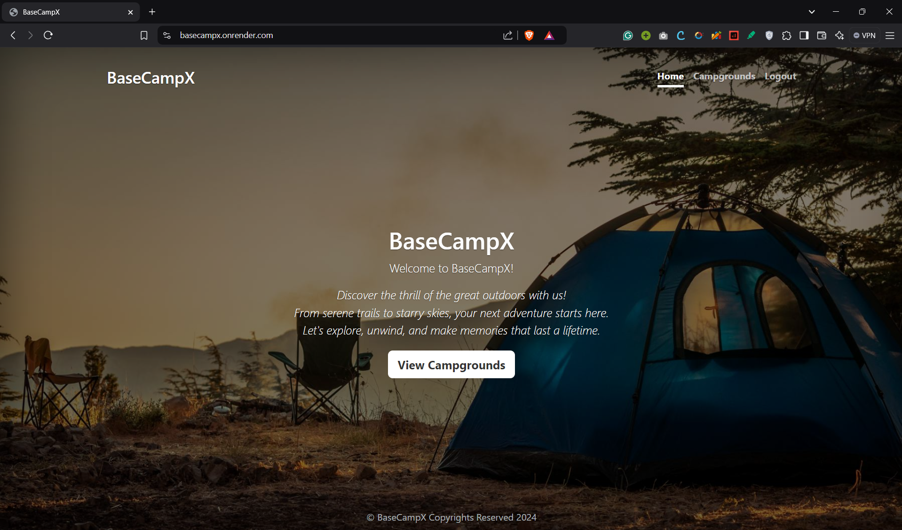
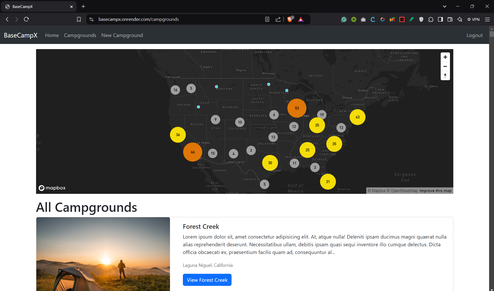
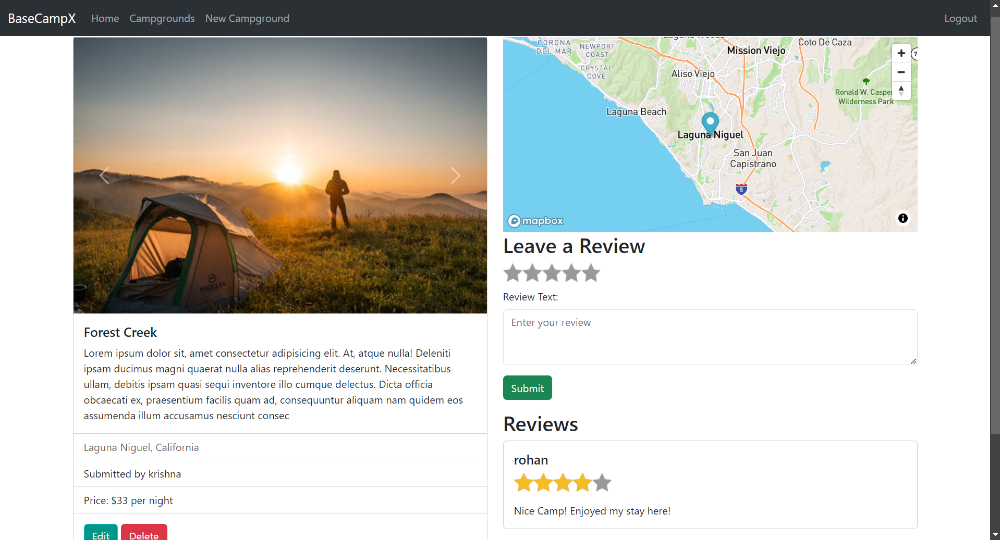
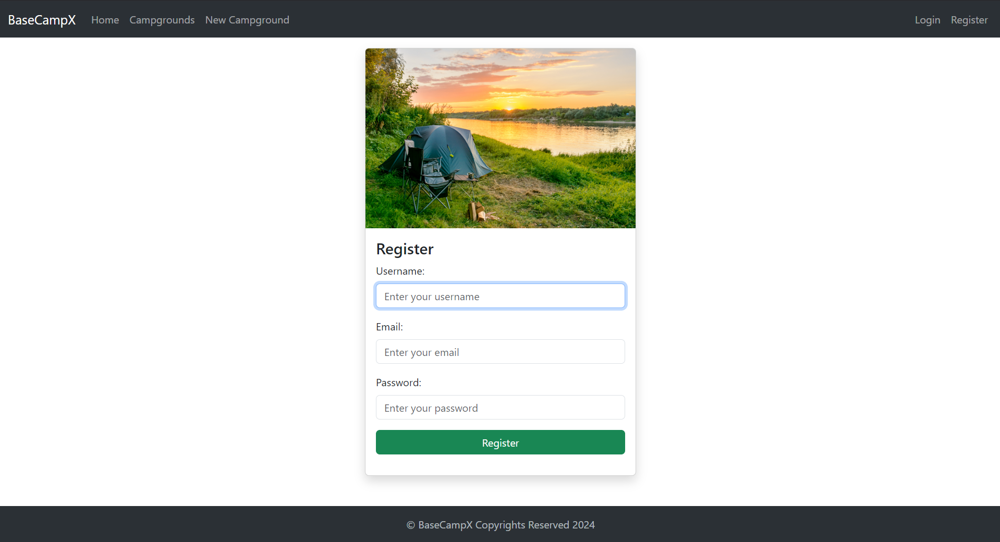

# BaseCampX Website
Camping Website! Add Campgrounds, review others campgrounds and much more!

## Live Website Link
https://basecampx.onrender.com/

<div style="display: flex; align-items: center; justify-content: space-evenly; flex-wrap: wrap; gap: 1rem">
    
    
    
    
</div>

## Features
- **Adventure Listings:** Explore a wide range of treks and camping destinations with detailed descriptions, images, and user reviews.

- **Interactive Map:** Discover nearby destinations and plan routes with an intuitive map interface.

## Tech Stack
- **Frontend:** Embedded JavaScript (EJS Template)
- **Backend:** Node.js, Express.js
- **Database:** MongoDB Atlas
- **APIs:** RESTful API design, Cloudinary, Mapbox
- **Hosting:** Render

##  Setup and Installation
1. Clone the repository & enter the BaseCampX directory.
2. Install dependencies:
```bash
npm install
```
3. Set up environment variables:
```bash
hello
```
*(Create a .env file in the root directory and add the following)*
```
DB_URL=<your-mongodb-connection-string>

CLOUDINARY_CLOUD_NAME=<your-cloudinary-cloud-name>
CLOUDINARY_KEY=<your-cloudinary-key>
CLOUDINARY_SECRET=<your-cloudinary-secret>

MAPBOX_TOKEN=<your-mapbox-token>

SECRET=<your-secret-string-for-session-and-mongostore>

# used to create seed data
PEXELS_API_KEY=<your-pexels-api-key>
```
4. Run the development server:
```bash
node app.js
```
5. Access the website locally at http://localhost:8080

## Contribution Guidelines
To contribute:
1. Fork the repository.
2. Create a new branch for your feature/bug fix.
3. Commit your changes with meaningful commit messages.
4. Push to your fork and submit a pull request.

## Contact
For any issues or suggestions, contact me at krishnaj@iitbhilai.ac.in